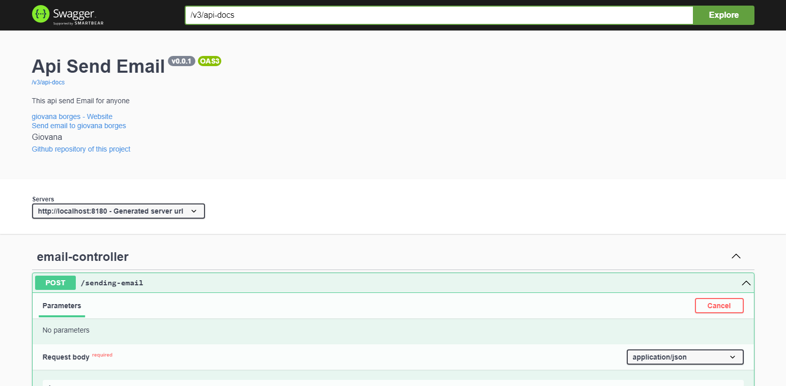

# Send email

This is a microservice that uses the Spring framework.

## About project

This repository was created in order to show how we can send emails through a rest api with springboot.

### Features

- Send emails
- See the emails that you sended

### Preview

Print of the finished project.

### Libraries used

- [springdoc](https://springdoc.org)
- [postgresql](https://www.postgresql.org/docs/)
- [lombok](https://projectlombok.org/features/all)
- [spring JPA](https://docs.spring.io/spring-data/jpa/docs/current/reference/html/)
- [spring MAIL](https://docs.spring.io/spring-framework/docs/3.2.x/spring-framework-reference/html/mail.html)

Made with ❤ 
By @GiovanaBorges.

## Project of
** [Michele Brito](https://github.com/MichelliBrito) **

